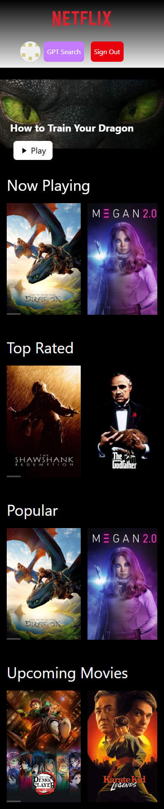
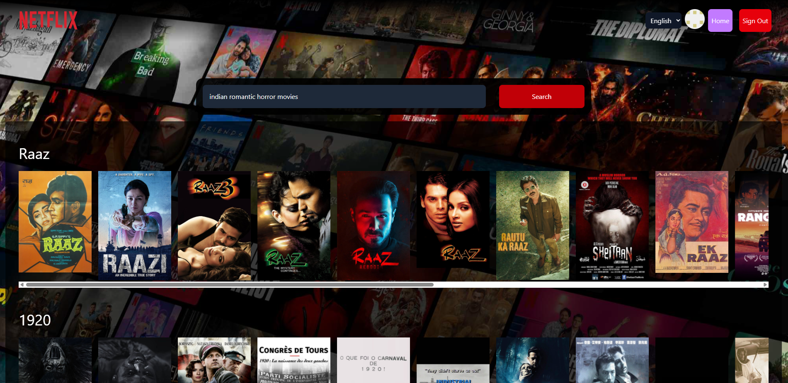
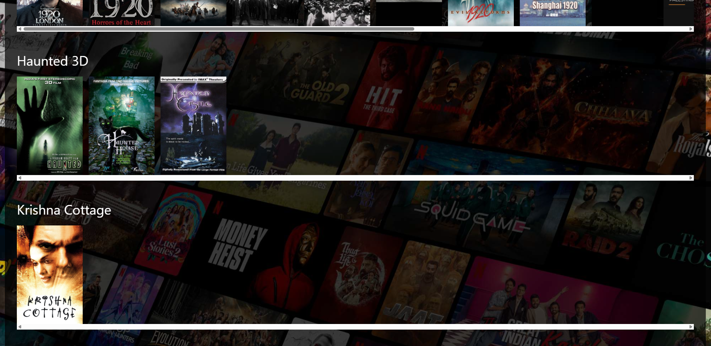
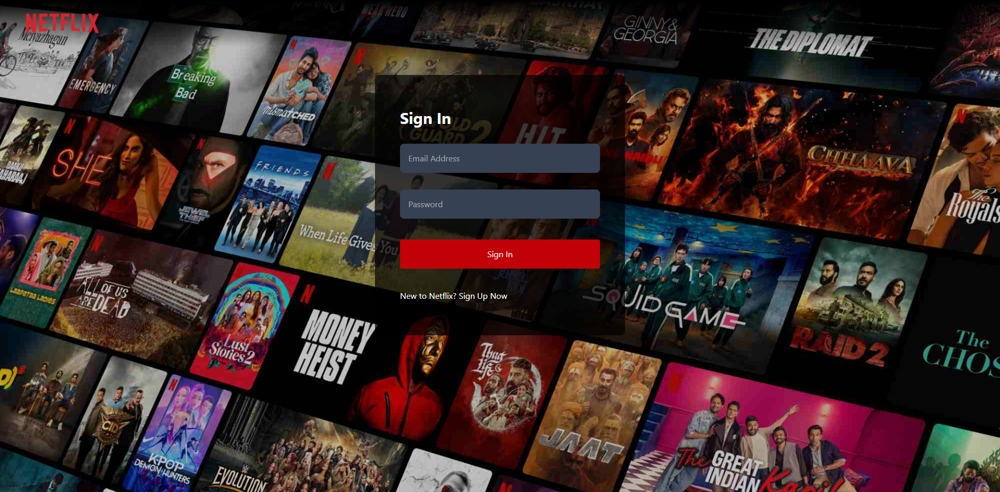
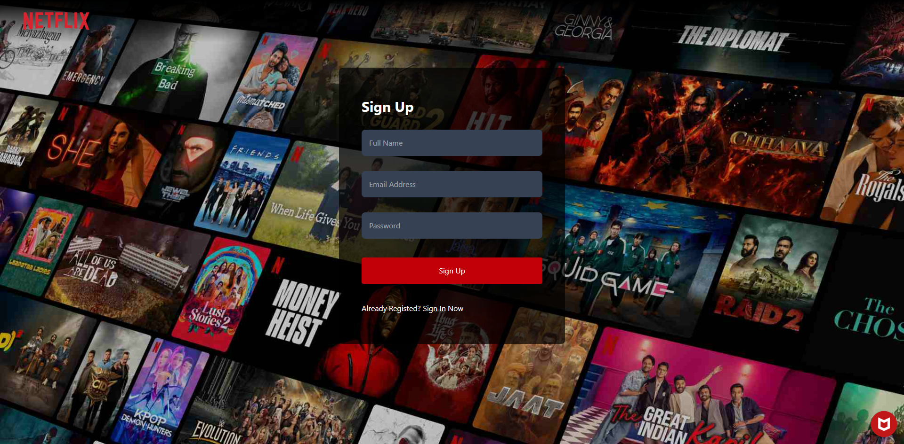
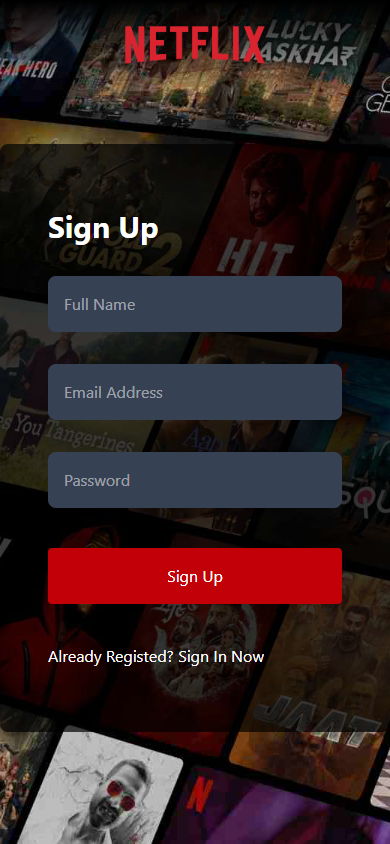

# 🎬 **NetflixGPT – ReactJS**

> A Netflix-inspired UI with AI-powered movie suggestions.
> Built with **Vite**, **React**, **TailwindCSS**, **Firebase**, **Redux**, **TMDB** & **OpenAI**.

---

## 🚀 Features

* ⚡ **Vite** for lightning‑fast development
* 🎨 **TailwindCSS** with `@apply`, transitions & modern utilities
* 🔄 **Client-side routing** with React Router
* 🔐 **Authentication**

  * Sign Up / Sign In forms
  * Form validation (Yup + React Hook Form)
  * Firebase Auth + Redux
  * Update profile (displayName & photoURL)
  * Sign Out & protected routes
* 🔧 **State Management** with Redux Toolkit

  * `userSlice` & `movieSlice`
* 🎥 **Browse Page**

  * Now‑Playing trailer background (autoplay & muted)
  * Main featured movie + description
  * Movie suggestions lists (reusable `<MovieList />`)
* 📊 **TMDB API** integration

  * Now‑playing, popular, top‑rated, upcoming
* ▶️ **Trailer Video** fetch & embed
* ✨ **GPT Search**

  * OpenAI + TMDB hybrid search
  * Multi‑language support
  * Custom hooks: `useGptSearch`, `useNowPlaying`, `usePopularMovies`
  * Memoization optimizations
* 🛠️ **Deployment** ready

  * `.env` for secrets
  * `.env` added to `.gitignore`
  * Deployed to Production

---

## 📸 **App Screenshots**

---

### 1. Browse Page (Desktop)


---

### 2. Browse Page (Mobile)



---

### 3. GPT Search Page (Desktop)



---

### 4. GPT Search Page (Mobile)


---

### 5. GPT Search Results



---

### 6. Login Page



---

### 7. Sign Up Page



---

### 8. Sign Up Page (Mobile)



---

## 🛠️ Project Setup

1. **Clone the repo**

   ```bash
   git clone https://github.com/your‑username/NetflixGPT.git
   cd NetflixGPT
   ```
2. **Install dependencies**

   ```bash
   npm install
   ```
3. **Add your API keys**
   Create a `.env` in the project root:

   ```
   VITE_TMDB_API_KEY=your_tmdb_key_here
   VITE_OPENAI_API_KEY=your_openai_key_here
   ```
4. **Run in development**

   ```bash
   npm run dev
   ```
5. **Build for production**

   ```bash
   npm run build
   npm run preview
   ```

---

Enjoy building your own AI‑enhanced Netflix clone! 🍿🔥
